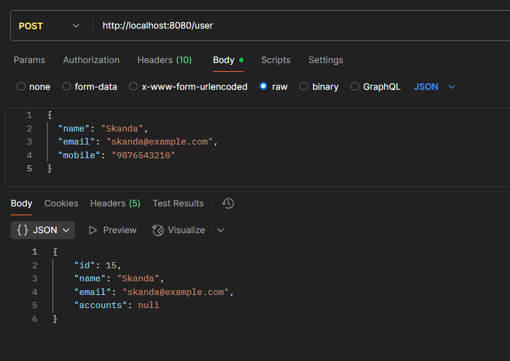
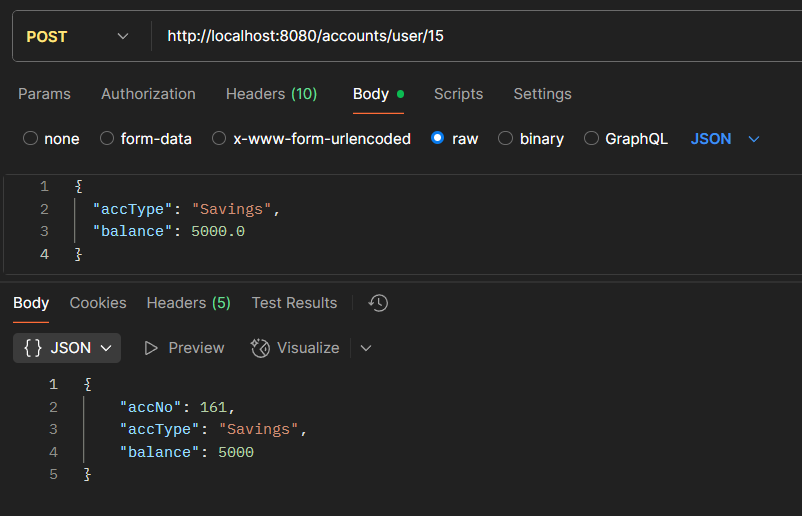
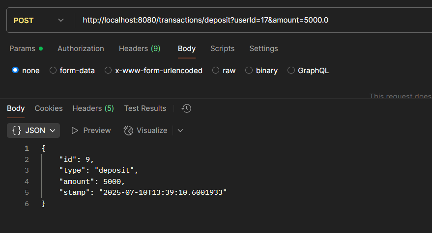
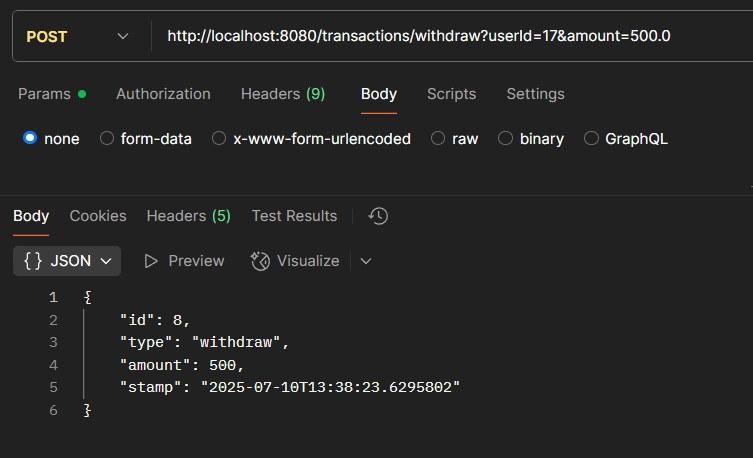
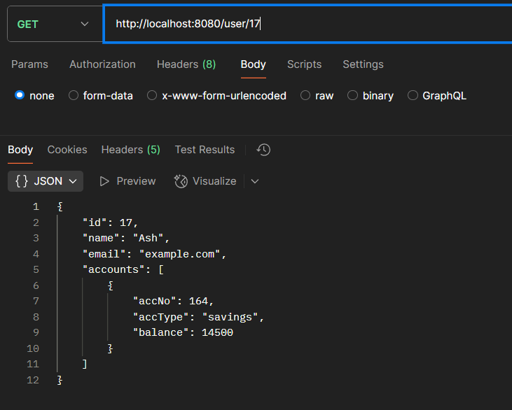
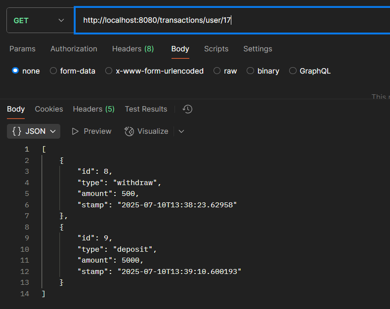

# 🏦 Mini Bank Application (Spring Boot)

A lightweight Spring Boot-based banking application that enables users to create accounts, perform deposits and withdrawals, and view transaction history — all via REST APIs. This project showcases modular code using OOP and Spring Boot best practices.

---

## 🚀 Features

- 🧑 Create a bank user
- 💼 Create multiple bank accounts (Savings/Current) for a user
- 💰 Deposit and withdraw funds
- 📜 View user transaction history
- 📌 Auto-credit ₹10,000 on account creation
- 🧠 Follows layered architecture (Controller → Service → Repository)

---

## 🛠️ Tech Stack

- Java 17+
- Spring Boot
- Spring Web, Spring Data JPA
- H2 / MySQL (Pluggable)
- REST APIs via Postman
- Gradle

---

## 📂 Project Structure

```
MiniBankApp/
├── controller/
├── service/
├── model/
├── repository/
├── images/
├── application.properties
└── MiniBankApplication.java
```

---

## 🔗 REST API Endpoints

### 📌 1. Create a User

**`POST /user`**
```json
{
  "name": "Ash",
  "email": "Ash@gmail.com",
  "mobile": "9876543210"
}
```


---

### 📌 2. Create Account for User

**`POST /user/{userId}`**
```json
{
  "accountType": "Savings"
  "balance":5000
}
```


---

### 💰 3. Deposit Money

**`POST /transactions/deposit?userId=1&amount=5000`**


---

### 💸 4. Withdraw Money

**`POST /transactions/withdraw?userId=1&amount=3000`**


---

### 🧾 5. Get User Details After Transactions

**`GET /accounts/user/{userId}`**


---

### 🧾 6. Get Transaction History

**`GET /transactions/user/{userId}`**


---

## ▶️ How to Run Locally

1. **Clone the repo**
```
git clone https://github.com/Skanda-10/MiniBankApp.git
cd MiniBankApp
```

2. **Update database config (`application.properties`)**
```properties
spring.datasource.url=jdbc:mysql://localhost:3306/minibank
spring.datasource.username=root
spring.datasource.password=yourpassword
```

3. **Run the app**
```
mvn spring-boot:run
```

---

## 🙋 Author

**Skanda**  
[GitHub](https://github.com/Skanda-10)

---

## 📄 License

This project is for educational and portfolio purposes. Free to use.
